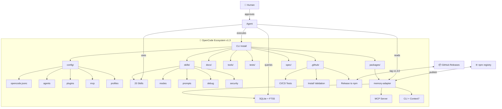
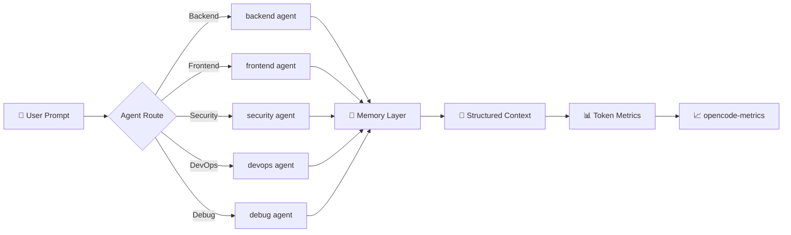

<p align="center">
  
</p>

<p align="center">
  
  
  
  
  
  
  
</p>

<p align="center">
  <b>Un comando. Cualquier agente. Cualquier OS.</b>
</p>

<p align="center">
  <i>Ecosistema open source para potenciar OpenCode con memoria persistente, SDD, skills, multi-modelo y multiagentes.</i>
</p>

---

## 🚀 Quick Start

Requiere **Node.js 22+** y **Git**.

### Linux / macOS

```bash
curl -sSL https://raw.githubusercontent.com/Rukawua26/opencode-ecosystem/main/install.sh | bash
```

Con verbose (debugging):

```bash
curl -sSL https://raw.githubusercontent.com/Rukawua26/opencode-ecosystem/main/install.sh | bash -s -- --verbose
```

### Windows (PowerShell)

```powershell
irm -useb https://raw.githubusercontent.com/Rukawua26/opencode-ecosystem/main/install.ps1 | iex
```

O descargando directamente:

```powershell
git clone https://github.com/Rukawua26/opencode-ecosystem.git
cd opencode-ecosystem
.\install.ps1
```

---

## 🏗️ Arquitectura



---

## 🔄 Flujo de Trabajo



---

## 🧰 Herramientas

### 🩺 Doctor — Verificar salud del ecosistema

```bash
# Ejecutar desde el repo
node tools/scripts/doctor.js

# O desde cualquier lugar (instalado por install.sh)
opencode-doctor
```

El comando `doctor` verifica:
- Dependencias (Node.js, npm, git)
- Estructura de directorios de OpenCode
- Skills instalados
- Memory Adapter y MCP
- Servidor Ollama local
- API Keys configuradas

### 📊 Medir ahorro de tokens

```bash
# Resumen de los últimos 7 días
opencode-metrics 7
```

Repite el comando después de una semana y compara tokens por mensaje, compactaciones, fallos y modelos. Consulta `docs/token-economy/measurement.md`.

---

## 📦 Qué incluye

| Componente | Descripción |
|---|---|
| **16+ agentes** | Especializados: backend, frontend, security, devops, etc. |
| **20 skills** | SDD, modes, prompts, debug, security, Obsidian y TDD |
| **8 plugins** | Kanban, guardrails, checkpoints, sandbox, personalities, validator, metrics y auto-memory |
| **4 MCP servers** | memory-adapter, local-model-router, context7 y diagram-generator |
| **Memory adapter** | SQLite + MCP server universal (OpenCode, Claude Code, Cursor, etc.) |
| **Multi-modelo** | Routing automático de modelo por fase de trabajo |
| **Perfiles** | work, personal, light |
| **CI/CD** | Tests automáticos, validación de install.sh, release a npm |

---

## 📂 Estructura

```
opencode-ecosystem/
├── config/          # opencode.jsonc, agents, plugins, mcp, profiles
├── skills/          # 20 skills exportables
├── packages/        # Paquetes npm (memory-adapter)
│   └── memory-adapter/
│       ├── src/        # Adapter, MCP server, CLI
│       ├── tests/      # 22 tests passing
│       └── package.json  # @rukawua26/opencode-memory-adapter@1.3.0
├── docs/            # Arquitectura, guías, token-economy
├── tools/           # Repo map builder, scripts
├── tests/           # Tests de skills e install.sh
├── .github/         # CI/CD workflows
└── spec/            # SDD del propio ecosistema
```

---

## 🔐 API Keys

Las API keys se configuran manualmente por seguridad:

```bash
cp .env.example ~/.config/opencode/.env
# Editar con tus keys
```

---

## 📊 Stats

<p align="center">
  
</p>

---

## 📜 Licencia

[MIT](https://opensource.org/licenses/MIT) © 2026 Rukawua26

<p align="center">
  <b>Hecho con ❤️ para la comunidad OpenCode</b>
</p>