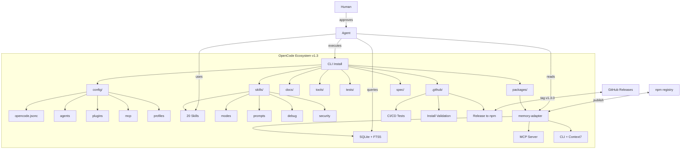
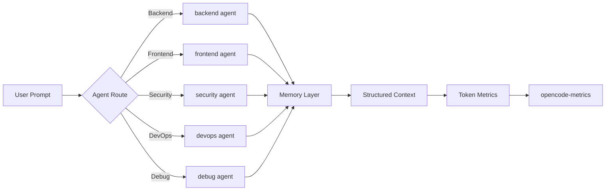
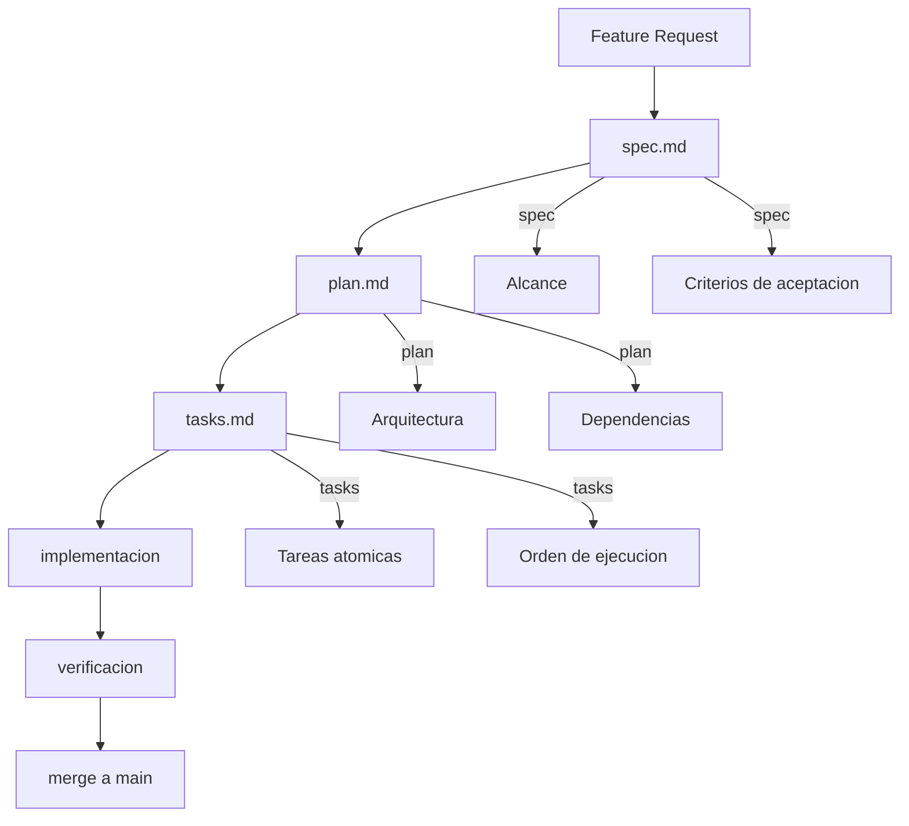
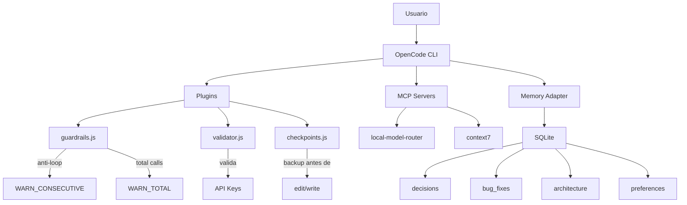

# Diagramas de Arquitectura

## Estructura General



## Flujo de Trabajo del Agente



## Flujo SDD (Spec-Driven Development)



## Diagrama de Seguridad



## Flujo de Release

```mermaid
flowchart LR
    A[PR merged a main] --> B[CI Tests]
    B --> C{Tests pass?}
    C -->|No| D[Fix required]
    C -->|Yes| E[Tag v1.3.0]
    E --> F[Release workflow]
    F --> G[npm publish]
    F --> H[GitHub Release]
    G --> I[@rukawua26/opencode-memory-adapter]
    H --> J[Release notes]
```
